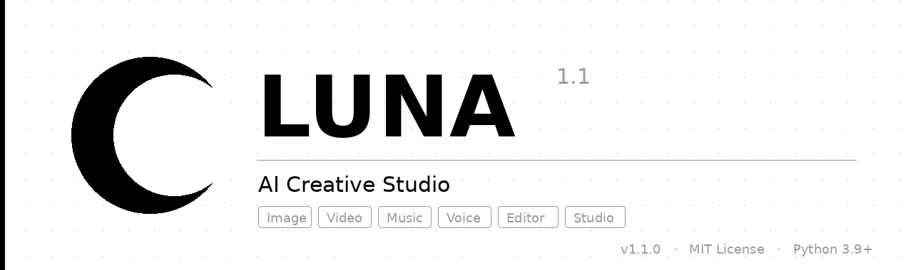

<div align="center">

<picture>
  <source media="(prefers-color-scheme: dark)" srcset="assets/banner_white.png">
  <source media="(prefers-color-scheme: light)" srcset="assets/banner_black.png">
  
</picture>

<br/>
<br/>

[](https://python.org)
[](LICENSE)
[]()
[](https://streamlit.io)
[](https://ffmpeg.org)

<br/>

> **One command. Full AI production.** — Image · Video · Music · Voice · Editor

<br/>

---

### ⚡ Open & Start Creating — No Install Needed

<br/>

[](https://share.streamlit.io/deploy?repository=adamyasingh-05/Luna1.1&branch=main&mainModule=app.py)
&nbsp;&nbsp;
[](https://colab.research.google.com/github/adamyasingh-05/Luna1.1/blob/main/colab_launch.ipynb)
&nbsp;&nbsp;
[](https://replit.com/github/adamyasingh-05/Luna1.1)
&nbsp;&nbsp;
[](https://huggingface.co/spaces/adamyasingh-05/luna11)

<br/>

| Method | Steps |
|---|---|
| 🟢 **Streamlit Cloud** | Click badge → sign in with GitHub → Deploy → **UI opens instantly** |
| 🟡 **Google Colab** | Click badge → Runtime → Run All → click the link that appears |
| 🔵 **Replit** | Click badge → Fork → Run → open the web preview |
| 🟣 **Hugging Face** | Visit the Space → UI loads in browser, zero setup |

<br/>

---

</div>

<br/>

## Table of Contents

- [What is Luna 1.1?](#what-is-luna-11)
- [Pipelines](#pipelines)
- [Quick Start (Local)](#quick-start-local)
- [API Keys](#api-keys)
- [CLI Reference](#cli-reference)
- [Web UI](#web-ui)
- [Project Structure](#project-structure)
- [Providers](#providers)
- [日本語](#日本語)
- [中文](#中文)
- [한국어](#한국어)

<br/>

---

## What is Luna 1.1?

Luna 1.1 is a **minimal, modular AI creative studio** that wraps the best open and commercial AI providers into a single, clean interface.

- Run it from the **command line** with one command
- Use the **Streamlit web UI** for a visual, no-code experience
- Use the **FastAPI server** to integrate into your own apps
- Deploy instantly to **Streamlit Cloud, Colab, Replit, or HuggingFace** — no local setup

Every pipeline is independent. Use only what you need.

<br/>

---

## Pipelines

| Pipeline | What it does | Providers |
|---|---|---|
| `image` | Text → image | fal.ai, Replicate, DALL-E 3, HuggingFace (free), local SDXL |
| `video` | Text → video + optional auto-captions | fal.ai, Replicate |
| `music` | Text → music / soundscape | Replicate MusicGen, local MusicGen |
| `tts` | Text → voice (300+ voices) | Edge TTS (free, no key), OpenAI TTS |
| `editor` | Cut, mix, overlay, caption video | FFmpeg (local, free) |
| `studio` | Text → full production (video + voice + music + captions) | All of the above |

<br/>

---

## Quick Start (Local)

**1. Clone**
```bash
git clone https://github.com/adamyasingh-05/Luna1.1.git
cd Luna1.1
```

**2. Install**
```bash
pip install -r requirements.txt
```

**3. Configure keys** *(optional — TTS and HuggingFace images work without any key)*
```bash
cp .env.example .env
# open .env and add your keys
```

**4. Health check**
```bash
python main.py doctor
```

**5. Launch Web UI**
```bash
streamlit run app.py
```
Open **http://localhost:8501** in your browser — done.

<br/>

---

## API Keys

Luna auto-selects the best available provider based on what keys you have set. Nothing breaks if a key is missing — it falls back gracefully.

| Key | Provider | Free Tier | Get it |
|---|---|---|---|
| `FAL_KEY` | fal.ai — fast image & video | ✅ Yes | [fal.ai](https://fal.ai) |
| `REPLICATE_API_TOKEN` | Replicate — premium models | ✅ Yes (pay-per-use, cheap) | [replicate.com](https://replicate.com) |
| `OPENAI_API_KEY` | DALL-E 3, OpenAI TTS, GPT enhance | ✅ Yes | [platform.openai.com](https://platform.openai.com) |
| `HF_TOKEN` | HuggingFace — free image gen | ✅ Free | [huggingface.co](https://huggingface.co/settings/tokens) |

> TTS via Edge TTS and HuggingFace image generation work with **zero API keys**.

Add keys to your `.env`:
```env
FAL_KEY=your_fal_key_here
REPLICATE_API_TOKEN=your_replicate_token_here
OPENAI_API_KEY=your_openai_key_here
HF_TOKEN=your_hf_token_here
```

<br/>

---

## CLI Reference

```bash
# ── Image ─────────────────────────────────────────────────────────────────────
python main.py image "a misty forest at dawn"
python main.py image "cyberpunk city" --style cinematic --size 1024x1024
python main.py image "portrait" --model dall-e --enhance --count 4

# ── Video ─────────────────────────────────────────────────────────────────────
python main.py video "ocean waves at sunset" --duration 8
python main.py video "wolf running" --style anime --duration 5 --enhance

# ── Music ─────────────────────────────────────────────────────────────────────
python main.py music "lo-fi hip hop, calm, 60bpm" --duration 30
python main.py music "epic orchestral battle theme" --duration 60

# ── Voice (TTS) ───────────────────────────────────────────────────────────────
python main.py tts "Hello world, this is Luna." --voice en-US-AriaNeural
python main.py tts "こんにちは" --voice ja-JP-NanamiNeural
python main.py tts "你好世界" --voice zh-CN-XiaoxiaoNeural

# ── Studio (full production) ──────────────────────────────────────────────────
python main.py studio "cinematic short film, noir style" --duration 30
python main.py studio "product promo" --style promo --music --captions

# ── System ────────────────────────────────────────────────────────────────────
python main.py doctor        # health check — shows what's ready
```

**Styles available:** `cinematic` `anime` `photorealistic` `artistic` `documentary` `promo`

<br/>

---

## Web UI

```bash
streamlit run app.py
```

Opens at **http://localhost:8501**

The UI has 5 tabs — Image, Video, TTS, Music, Studio — with a live task monitor showing real-time progress and logs for every queued job.

For the REST API:
```bash
uvicorn main_fastapi:app --reload
# Docs at http://localhost:8000/docs
```

<br/>

---

## Project Structure

```
Luna1.1/
│
├── main.py                  # CLI entrypoint  →  python main.py <pipeline>
├── app.py                   # Streamlit web UI  →  streamlit run app.py
├── main_fastapi.py          # FastAPI REST server  →  uvicorn main_fastapi:app
├── colab_launch.ipynb       # One-click Google Colab launcher
├── requirements.txt         # Core dependencies
├── setup.py                 # Package setup
├── .env.example             # API key template
├── install.sh               # One-line install script
│
├── pipelines/               # Core pipeline modules
│   ├── image.py             # Image generation
│   ├── video.py             # Video generation + captions
│   ├── music.py             # Music generation
│   ├── tts.py               # Text-to-speech
│   ├── editor.py            # FFmpeg video editor
│   └── studio.py            # Full production orchestrator
│
├── models/                  # Model configs & selectors
│   └── image_models.py      # Image model registry
│
├── skills/                  # Prompt presets & style helpers
│   └── style_presets.py     # Style → prompt modifier map
│
├── utils/                   # Shared utilities
│   ├── config.py            # Config loader (.env)
│   ├── logger.py            # Colored terminal logger
│   └── prompt_enhancer.py   # GPT-based prompt enhancement
│
└── assets/                  # Logos and banners
    ├── banner.png
    ├── banner_black.png
    ├── banner_white.png
    ├── logo_black.png
    └── logo_white.png
```

<br/>

---

## Providers

Luna auto-detects which providers are available based on installed packages and API keys. Priority order:

```
Image:   fal.ai → Replicate → DALL-E → HuggingFace (free) → local SDXL
Video:   fal.ai → Replicate
Music:   Replicate MusicGen → local MusicGen (slow on CPU)
TTS:     Edge TTS (free) → OpenAI TTS
Editor:  FFmpeg (local, always free)
```

Install only what you need:
```bash
pip install fal-client              # fal.ai — fast, free tier
pip install replicate               # Replicate — premium quality
pip install openai                  # DALL-E 3 + OpenAI TTS + GPT
pip install diffusers torch         # Local SDXL (GPU strongly recommended)
pip install openai-whisper          # Auto-captions (local, free)
```

System dependency for video features:
```bash
# macOS
brew install ffmpeg

# Ubuntu / Debian
sudo apt install ffmpeg

# Windows
# Download from https://ffmpeg.org/download.html
```

<br/>

---

<br/>

## 日本語

### 概要

Luna 1.1 は、ミニマルでモジュール設計のAIクリエイティブスタジオです。画像・動画・音楽・音声の生成から、フルスタジオ制作まで、単一コマンドで実行できます。ブラウザから直接起動することも可能です。

### ⚡ すぐに開く

[](https://share.streamlit.io/deploy?repository=adamyasingh-05/Luna1.1&branch=main&mainModule=app.py)
&nbsp;
[](https://colab.research.google.com/github/adamyasingh-05/Luna1.1/blob/main/colab_launch.ipynb)

### インストール

```bash
git clone https://github.com/adamyasingh-05/Luna1.1.git
cd Luna1.1
pip install -r requirements.txt
cp .env.example .env
python main.py doctor
streamlit run app.py
```

### 使い方

```bash
python main.py image "夜明けの霧の森"
python main.py video "夕暮れの海" --duration 8
python main.py music "lo-fi, 落ち着いたビート, 60bpm" --duration 30
python main.py tts "こんにちは世界" --voice ja-JP-NanamiNeural
python main.py studio "ノワールスタイルの短編映画" --music --captions
```

### 機能一覧

| パイプライン | 説明 | 無料 |
|---|---|---|
| `image` | テキストから画像 | ✅ HuggingFace |
| `video` | テキストから動画 + 自動字幕 | fal.ai無料枠 |
| `music` | AIによる音楽生成 | ローカル可 |
| `tts` | 300+音声テキスト読み上げ | ✅ Edge TTS |
| `editor` | FFmpegビデオ編集 | ✅ 常時無料 |
| `studio` | フルプロダクション一括実行 | 各プロバイダ依存 |

<br/>

---

<br/>

## 中文

### 概述

Luna 1.1 是一款极简、模块化的 AI 创作工作室。通过单一命令即可完成图像、视频、音乐、语音生成，乃至完整制作流程。也可直接在浏览器中打开使用。

### ⚡ 直接打开

[](https://share.streamlit.io/deploy?repository=adamyasingh-05/Luna1.1&branch=main&mainModule=app.py)
&nbsp;
[](https://colab.research.google.com/github/adamyasingh-05/Luna1.1/blob/main/colab_launch.ipynb)

### 安装

```bash
git clone https://github.com/adamyasingh-05/Luna1.1.git
cd Luna1.1
pip install -r requirements.txt
cp .env.example .env
python main.py doctor
streamlit run app.py
```

### 使用方法

```bash
python main.py image "黎明时分的迷雾森林"
python main.py video "日落时的海浪" --duration 8
python main.py music "lo-fi 嘻哈, 平静, 60bpm" --duration 30
python main.py tts "你好，世界" --voice zh-CN-XiaoxiaoNeural
python main.py studio "黑色电影风格短片" --music --captions
```

### 功能列表

| 管道 | 说明 | 免费 |
|---|---|---|
| `image` | 文本生图 | ✅ HuggingFace |
| `video` | 文本生视频 + 自动字幕 | fal.ai 免费额度 |
| `music` | AI 音乐生成 | 可本地运行 |
| `tts` | 300+ 种语音文字转语音 | ✅ Edge TTS |
| `editor` | FFmpeg 视频编辑 | ✅ 始终免费 |
| `studio` | 一键完整制作 | 取决于各提供商 |

<br/>

---

<br/>

## 한국어

### 개요

Luna 1.1은 미니멀하고 모듈화된 AI 크리에이티브 스튜디오입니다. 이미지, 영상, 음악, 음성 생성부터 완전한 스튜디오 제작까지 단일 명령으로 실행할 수 있습니다. 브라우저에서 바로 열 수도 있습니다.

### ⚡ 바로 열기

[](https://share.streamlit.io/deploy?repository=adamyasingh-05/Luna1.1&branch=main&mainModule=app.py)
&nbsp;
[](https://colab.research.google.com/github/adamyasingh-05/Luna1.1/blob/main/colab_launch.ipynb)

### 설치

```bash
git clone https://github.com/adamyasingh-05/Luna1.1.git
cd Luna1.1
pip install -r requirements.txt
cp .env.example .env
python main.py doctor
streamlit run app.py
```

### 사용법

```bash
python main.py image "새벽 안개 속 숲"
python main.py video "노을 지는 바다" --duration 8
python main.py music "lo-fi 힙합, 잔잔한, 60bpm" --duration 30
python main.py tts "안녕하세요 세계" --voice ko-KR-SunHiNeural
python main.py studio "누아르 스타일 단편 영화" --music --captions
```

### 기능 목록

| 파이프라인 | 설명 | 무료 |
|---|---|---|
| `image` | 텍스트-이미지 | ✅ HuggingFace |
| `video` | 텍스트-영상 + 자동 자막 | fal.ai 무료 한도 |
| `music` | AI 음악 생성 | 로컬 가능 |
| `tts` | 300개+ 음성 변환 | ✅ Edge TTS |
| `editor` | FFmpeg 영상 편집 | ✅ 항상 무료 |
| `studio` | 원커맨드 전체 제작 | 각 공급자 의존 |

<br/>

---

<div align="center">

<br/>

<picture>
  <source media="(prefers-color-scheme: dark)" srcset="assets/logo_white.png">
  <source media="(prefers-color-scheme: light)" srcset="assets/logo_black.png">
  
</picture>

<br/>
<br/>

**Luna 1.1** &nbsp;·&nbsp; MIT License &nbsp;·&nbsp; [github.com/adamyasingh-05/Luna1.1](https://github.com/adamyasingh-05/Luna1.1)

<br/>

*Made with minimalism in mind.*

</div>
